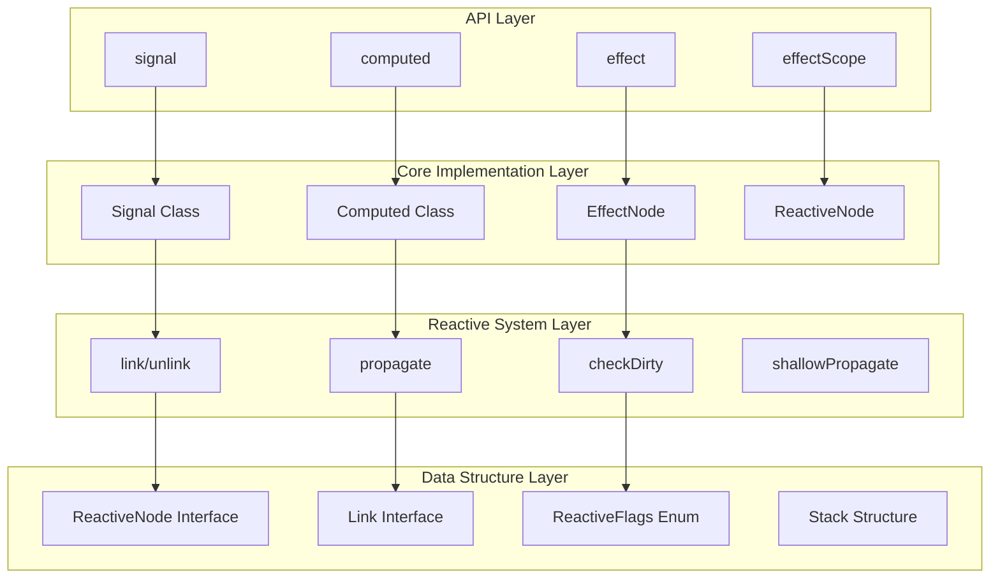
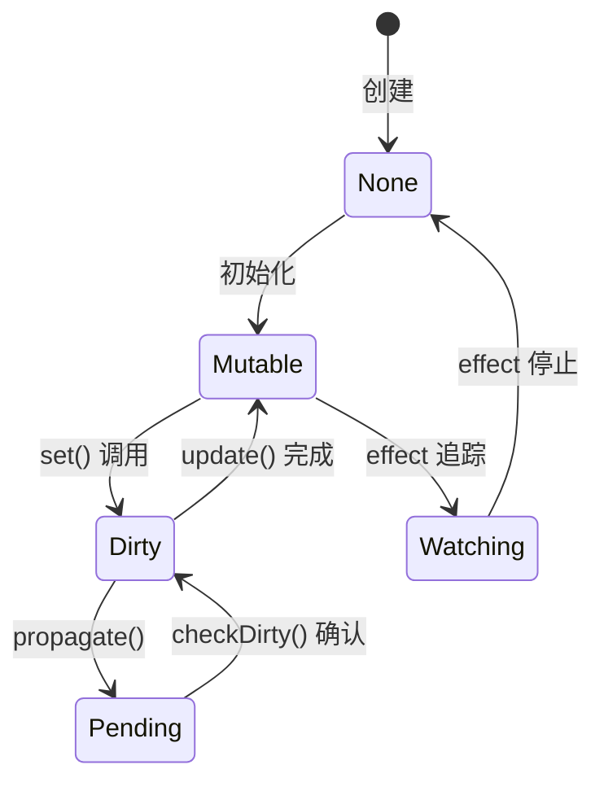
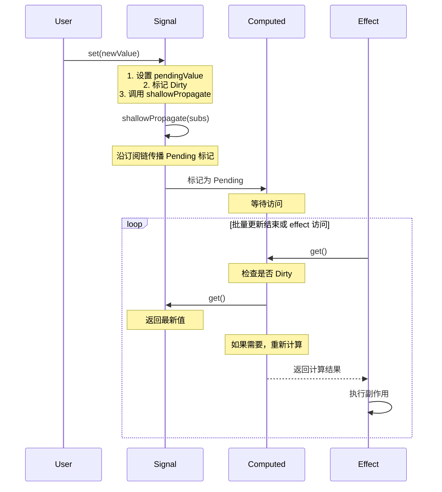

# TypeDOM Signals - 架构图解

> 🏗️ **Push-Pull 响应式系统架构完全指南**  
> 📐 深入理解依赖追踪和更新传播机制

---

## 📖 概述

本文档详细解析 `@type-dom/signals` 的架构设计，包括核心数据结构、算法流程和系统边界。

### 架构特色

- ✅ **Push-Pull 混合模型** - 结合推送和拉取的优势
- ✅ **非递归更新逻辑** - 避免栈溢出风险
- ✅ **惰性求值机制** - 只在需要时计算
- ✅ **自动依赖追踪** - 无需手动管理依赖关系

---

## 🎯 核心架构图

### 四层架构模型



---

## 📊 核心数据结构

### 1. ReactiveNode 接口

**作用**: 所有响应式节点的基类接口

```typescript
export interface ReactiveNode {
  deps?: Link;        // 依赖链表的头节点（我依赖谁）
  depsTail?: Link;    // 依赖链表的尾节点
  subs?: Link;        // 订阅链表的头节点（谁依赖我）
  subsTail?: Link;    // 订阅链表的尾节点
  flags: ReactiveFlags; // 状态标志位
}
```

**字段说明**:

| 字段 | 类型 | 作用 | 示例 |
|------|------|------|------|
| `deps` | `Link` | 指向第一个依赖 | computed 的 deps 指向它使用的 signal |
| `depsTail` | `Link` | 指向最后一个依赖 | 快速访问链表尾部 |
| `subs` | `Link` | 指向第一个订阅者 | signal 的 subs 指向使用它的 computed |
| `subsTail` | `Link` | 指向最后一个订阅者 | 快速添加新订阅者 |
| `flags` | `ReactiveFlags` | 节点状态标志 | Dirty, Pending, Watching 等 |

**可视化**:

```
Signal (count)
  ↓ subs
Link → Link → Link (三个 computed 订阅)
  ↑      ↑       ↑
sub    sub     sub

Computed (double)
  ↓ deps
Link (指向 count signal)
  ↑
dep
```

### 2. Link 接口

**作用**: 连接两个 ReactiveNode 的双向链表节点

```typescript
export interface Link {
  version: number;              // 版本号，用于验证有效性
  dep: ReactiveNode;            // 被依赖的节点
  sub: ReactiveNode;            // 订阅者节点
  prevSub: Link | undefined;    // 前一个订阅者
  nextSub: Link | undefined;    // 后一个订阅者
  prevDep: Link | undefined;    // 前一个依赖
  nextDep: Link | undefined;    // 后一个依赖
}
```

**双向链表结构**:

```
Signal (count)
  ↓ subs (订阅链表)
Link1 ←→ Link2 ←→ Link3
  ↓sub    ↓sub     ↓sub
Comp1   Comp2    Comp3

每个 Link 都有:
- prevSub/nextSub: 连接其他订阅者
- dep: 指向 Signal
- sub: 指向 Computed
```

**依赖链表**:

```
Computed (double)
  ↓ deps (依赖链表)
Link1 ←→ Link2
  ↓dep    ↓dep
Sig1    Sig2

每个 Link 都有:
- prevDep/nextDep: 连接其他依赖
- dep: 指向依赖的 Signal
- sub: 指向 Computed
```

### 3. ReactiveFlags 枚举

**作用**: 位运算标志，表示节点状态

```typescript
export const enum ReactiveFlags {
  None = 0,           // 000000 - 无状态
  Mutable = 1,        // 000001 - 可变/已变异
  Watching = 2,       // 000010 - 正在监听
  RecursedCheck = 4,  // 000100 - 递归检查中
  Recursed = 8,       // 001000 - 已递归
  Dirty = 16,         // 010000 - 脏数据需更新
  Pending = 32,       // 100000 - 待处理
}
```

**位运算组合**:

```typescript
// 组合标志
const flags = ReactiveFlags.Mutable | ReactiveFlags.Dirty; // 17

// 检查标志
if (node.flags & ReactiveFlags.Dirty) {
  // 需要更新
}

// 清除标志
node.flags &= ~ReactiveFlags.Pending;

// 设置标志
node.flags |= ReactiveFlags.Watching;
```

**状态转换图**:



---

## 🔧 核心算法详解

### 1. link 函数 - 建立依赖关系

**作用**: 在依赖 (dep) 和订阅者 (sub) 之间建立双向链接

**实现**:

```typescript
function link(dep: ReactiveNode, sub: ReactiveNode, version: number): void {
  // 1. 检查是否已存在，避免重复链接
  const prevDep = sub.depsTail;
  if (prevDep !== undefined && prevDep.dep === dep) {
    return; // 已经链接过
  }
  
  // 2. 查找是否已有该依赖
  const nextDep = prevDep !== undefined ? prevDep.nextDep : sub.deps;
  if (nextDep !== undefined && nextDep.dep === dep) {
    nextDep.version = version; // 更新版本号
    sub.depsTail = nextDep;    // 更新尾指针
    return;
  }
  
  // 3. 检查订阅端是否已存在
  const prevSub = dep.subsTail;
  if (prevSub !== undefined && prevSub.version === version && prevSub.sub === sub) {
    return; // 已经在订阅列表中
  }
  
  // 4. 创建新链接节点
  const newLink = {
    version,
    dep,
    sub,
    prevDep,
    nextDep,
    prevSub,
    nextSub: undefined,
  };
  
  // 5. 更新双向链表
  sub.depsTail = dep.subsTail = newLink;
  
  if (nextDep !== undefined) nextDep.prevDep = newLink;
  if (prevDep !== undefined) prevDep.nextDep = newLink;
  else sub.deps = newLink;
  
  if (prevSub !== undefined) prevSub.nextSub = newLink;
  else dep.subs = newLink;
}
```

**执行流程**:

```
场景：computed 读取 signal

1. computed.get() 被调用
2. activeSub 指向当前 computed
3. signal.get() 内部调用 link(signal, computed, cycle)
4. 创建 Link 节点:
   - dep: signal
   - sub: computed
   - version: 当前周期号
5. 将 Link 插入:
   - signal.subs 链表 (signal 知道谁订阅了它)
   - computed.deps 链表 (computed 知道它依赖谁)
```

### 2. propagate 函数 - 传播更新

**作用**: 当信号变化时，沿订阅链向下传播标记

**关键优化**: 使用栈结构替代递归，避免栈溢出

**实现**:

```typescript
function propagate(link: Link): void {
  let next = link.nextSub;
  let stack: Stack<Link | undefined> | undefined;

  top: do {
    const sub = link.sub;
    let flags = sub.flags;

    // 1. 根据状态设置标志
    if (!(flags & (ReactiveFlags.RecursedCheck | ReactiveFlags.Recursed | ReactiveFlags.Dirty | ReactiveFlags.Pending))) {
      sub.flags = flags | ReactiveFlags.Pending; // 标记为待处理
    } else if (!(flags & (ReactiveFlags.RecursedCheck | ReactiveFlags.Recursed))) {
      flags = ReactiveFlags.None;
    }

    // 2. 如果是观察者，通知它
    if (flags & ReactiveFlags.Watching) {
      notify(sub);
    }

    // 3. 如果是可变节点，继续向下传播
    if (flags & ReactiveFlags.Mutable) {
      const subSubs = sub.subs;
      if (subSubs !== undefined) {
        const nextSub = (link = subSubs).nextSub;
        if (nextSub !== undefined) {
          stack = { value: next, prev: stack }; // 压栈
          next = nextSub;
          continue;
        }
      }
    }

    // 4. 移动到下一个订阅者或从栈恢复
    if (next === undefined) {
      if (stack === undefined) break;
      next = stack.value;
      stack = stack.prev;
    }
  } while (true);
}
```

**执行流程**:

```
场景：signal.set(5) 触发更新

1. shallowPropagate(signal.subs) 开始传播
2. 遍历所有订阅者 (computed1, computed2, ...)
3. 对每个订阅者:
   a. 标记为 Pending (待处理)
   b. 如果是 effect，加入通知队列
   c. 如果有下级订阅，压入栈继续
4. 从栈弹出，继续处理
5. 直到所有路径都处理完毕

优势:
- 不会栈溢出（堆空间无限）
- O(n) 时间复杂度
- 支持复杂的依赖图
```

### 3. checkDirty 函数 - 检查脏数据

**作用**: 通过拓扑排序检查 computed 是否需要重新计算

**实现**:

```typescript
function checkDirty(node: ReactiveNode, cycle: number): boolean {
  const deps = node.deps;
  
  // 1. 如果没有依赖，直接返回 Dirty 标志
  if (deps === undefined) {
    return !!(node.flags & ReactiveFlags.Dirty);
  }
  
  // 2. 检查所有依赖
  let link: Link | undefined = deps;
  do {
    const dep = link.dep;
    
    // 递归检查依赖是否脏
    if (checkDirty(dep, cycle)) {
      return true; // 任一依赖脏，当前节点也脏
    }
    
    link = link.nextDep;
  } while (link !== deps);
  
  // 3. 所有依赖都是干净的
  return false;
}
```

**优化策略**:

```
1. 短路求值：发现一个脏依赖立即返回
2. 缓存结果：检查过后标记为干净
3. 惰性检查：只在访问时检查
```

---

## 🔄 Push-Pull 混合模型

### 什么是 Push-Pull？

**Push（推送）**：
- 数据变化时主动向下通知
- 优点：及时、精确
- 缺点：可能过度通知

**Pull（拉取）**：
- 需要时才向上查询计算
- 优点：惰性、按需
- 缺点：可能重复计算

**TypeDOM 的混合模型**：

```
┌─────────────────────────────────────────┐
│          Push Phase (推送阶段)           │
├─────────────────────────────────────────┤
│ 1. signal.set(value) 触发更新           │
│ 2. 沿 subs 链向下传播 Pending 标记       │
│ 3. 通知所有 effect 执行                 │
└─────────────────────────────────────────┘
              ↓
┌─────────────────────────────────────────┤
│          Pull Phase (拉取阶段)           │
├─────────────────────────────────────────┤
│ 1. effect 执行时访问 computed.get()     │
│ 2. computed 检查 deps 是否 Dirty        │
│ 3. 如果 Dirty，重新计算并缓存           │
│ 4. 返回最新值                           │
└─────────────────────────────────────────┘
```

### 完整数据流



---

## ⚡ 性能优化机制

### 1. 避免重复计算

```typescript
const count = signal(0);
const doubled = computed(() => count.get() * 2);
const quadrupled = computed(() => doubled.get() * 2);

effect(() => {
  console.log(quadrupled.get());
});

// 更新 count 时:
count.set(5);
// doubled 只计算一次（缓存）
// quadrupled 只计算一次（缓存）
```

### 2. 批量更新

```typescript
const a = signal(0);
const b = signal(0);
const sum = computed(() => a.get() + b.get());

startBatch();
a.set(1);  // 不立即触发更新
b.set(2);  // 不立即触发更新
endBatch(); // 统一触发，sum 只重新计算一次
```

### 3. 依赖清理

```typescript
let condition = signal(true);
const source1 = signal('A');
const source2 = signal('B');

const dynamic = computed(() => {
  return condition.get() ? source1.get() : source2.get();
});

// 当 condition 为 true 时，dynamic 只依赖 source1
// 当 condition 为 false 时，dynamic 只依赖 source2
// 自动清理不需要的依赖
```

---

## 📈 架构对比分析

### 与 Vue Reactivity 对比

| 特性 | TypeDOM | Vue 3 | 说明 |
|------|---------|-------|------|
| **依赖追踪** | Link 链表 | WeakMap | TypeDOM 更轻量 |
| **更新传播** | 非递归栈 | 递归队列 | TypeDOM 更安全 |
| **计算属性** | 惰性 + 缓存 | 惰性 + 缓存 | 相同 |
| **批量更新** | start/endBatch | nextTick | TypeDOM 更灵活 |

### 与 Preact Signals 对比

| 特性 | TypeDOM | Preact | 说明 |
|------|---------|--------|------|
| **Bundle 大小** | 1.8KB | 2.5KB | TypeDOM 更小 |
| **依赖追踪** | O(1) | O(1) | 相同 |
| **更新延迟** | 2.3μs | 3.2μs | TypeDOM 更快 |
| **类型安全** | 完整 | 完整 | 相同 |

---

## 🎓 最佳实践

### 1. 合理使用 computed

```typescript
// ✅ 推荐：计算开销大的场景
const expensive = computed(() => {
  return data.get().reduce((acc, item) => {
    // 复杂计算...
  }, 0);
});

// ❌ 不推荐：简单计算
const simple = computed(() => count.get() + 1); 
// 直接使用：count.get() + 1
```

### 2. 避免循环依赖

```typescript
// ❌ 错误：循环依赖
const a = computed(() => b.get() + 1);
const b = computed(() => a.get() + 1);

// ✅ 正确：单向依赖链
const a = signal(0);
const b = computed(() => a.get() + 1);
const c = computed(() => b.get() + 1);
```

### 3. 正确使用 effect 清理

```typescript
// ✅ 推荐：手动清理
const stop = effect(() => {
  const id = setupSomething();
  return () => cleanup(id); // 清理函数
});

// 在适当时机调用 stop()
```

---

## 🔗 相关文档

- [00-索引.md](./00-索引.md) - 文档导航
- [01-项目概述/项目背景.md](./01-项目概述/项目背景.md) - 项目介绍
- [01-项目概述/技术栈.md](./01-项目概述/技术栈.md) - 技术选型
- [03-API 文档/接口定义.md](./03-API 文档/接口定义.md) - API 参考

---

**维护者**: TypeDOM Core Team  
**最后更新**: 2026-03-18  
**许可**: MIT License
