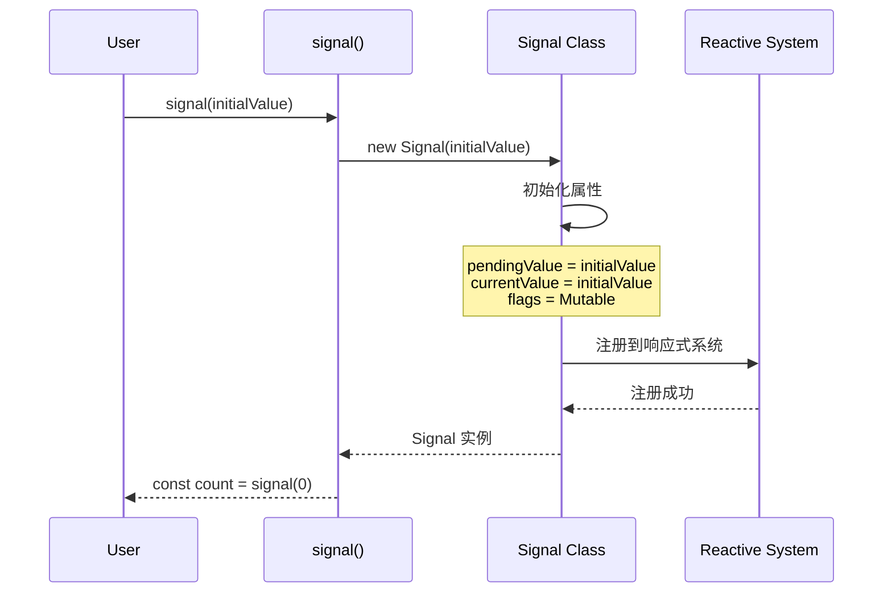
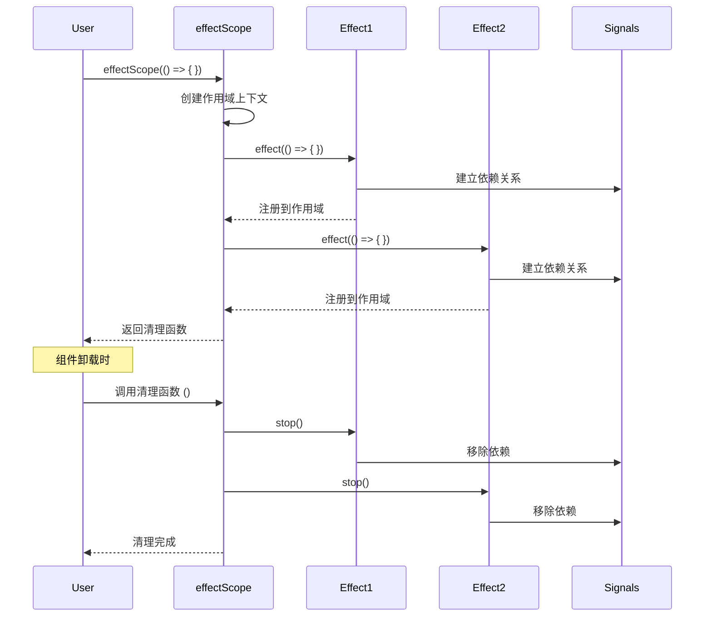

# TypeDOM Signals - 业务流程详解

> 💼 **核心业务流程和使用场景**  
> 🔄 从初始化到更新的完整生命周期

---

## 📖 概述

本文档详细说明 `@type-dom/signals` 的核心业务流程，包括信号创建、依赖追踪、更新传播等关键流程。

### 核心流程列表

1. **信号创建流程** - 从 signal() 到 ReactiveNode
2. **依赖追踪流程** - computed 读取 signal 时的依赖建立
3. **更新传播流程** - signal.set() 触发的连锁反应
4. **批量更新流程** - startBatch/endBatch 的协作机制
5. **作用域管理流程** - effectScope 的生命周期

---

## 🎯 流程一：信号创建

### 流程图



### 详细步骤

**步骤 1: 调用 signal 函数**

```typescript
// 用户代码
const count = signal(0);
const user = signal<User | null>(null);
const items = signal<Item[]>([]);
```

**步骤 2: signal 工厂函数处理**

```typescript
export function signal<T>(initialValue?: T): Signal<T> {
  // 类型检查（编译时）
  // T 被推断为 number | User | Item[]
  
  // 创建 Signal 实例
  return new Signal<T>(initialValue);
}
```

**步骤 3: Signal 构造函数初始化**

```typescript
export class Signal<T = unknown> implements SignalNode<T> {
  pendingValue: T | undefined;
  currentValue: T | undefined;
  subs?: Link;
  subsTail?: Link;
  flags: ReactiveFlags;

  constructor(initialValue?: T) {
    // 处理参数
    if (arguments.length) {
      this.pendingValue = initialValue;
      this.currentValue = initialValue;
    }
    
    // 设置初始标志
    this.flags = ReactiveFlags.Mutable;
    
    // 此时 Signal 状态:
    // - pendingValue = initialValue
    // - currentValue = initialValue
    // - subs = undefined (无订阅者)
    // - deps = undefined (无依赖)
    // - flags = Mutable (可变异)
  }
}
```

**步骤 4: 返回可用的 Signal**

```typescript
// 最终结果
count: Signal<number> = {
  pendingValue: 0,
  currentValue: 0,
  subs: undefined,
  deps: undefined,
  flags: ReactiveFlags.Mutable
}
```

---

## 🔄 流程二：依赖追踪

### 场景说明

当 computed 首次被访问时，会建立依赖关系。

### 完整流程

```mermaid
graph TB
    A[computed.get() 被调用] --> B[设置 activeSub = computed]
    B --> C[执行 getter 函数]
    C --> D[getter 内访问 signal.get()]
    D --> E[signal.get() 检查 activeSub]
    E --> F{activeSub 存在？}
    F -->|是 | G[调用 linkReactiveNode]
    F -->|否 | H[跳过依赖追踪]
    G --> I[创建 Link 节点]
    I --> J[插入到双向链表]
    J --> K[signal.subs 添加 computed]
    K --> L[computed.deps 添加 signal]
    L --> M[依赖追踪完成]
```

### 代码示例

```typescript
// 准备数据
const firstName = signal('John');
const lastName = signal('Doe');

// 创建计算属性
const fullName = computed(() => {
  return `${firstName.get()} ${lastName.get()}`;
});

// 首次访问 - 触发依赖追踪
console.log(fullName.get());

// 内部流程:
// 1. fullName.get() 被调用
// 2. activeSub = fullName (当前计算的 computed)
// 3. 执行 getter: () => `${firstName.get()} ${lastName.get()}`
// 4. 访问 firstName.get()
//    - 检查 activeSub 存在
//    - 调用 link(firstName, fullName, cycle)
//    - 创建 Link1: dep=firstName, sub=fullName
//    - 添加到 firstName.subs 链表
//    - 添加到 fullName.deps 链表
// 5. 访问 lastName.get()
//    - 检查 activeSub 存在
//    - 调用 link(lastName, fullName, cycle)
//    - 创建 Link2: dep=lastName, sub=fullName
//    - 添加到 lastName.subs 链表
//    - 添加到 fullName.deps 链表
// 6. getter 执行完毕，返回 "John Doe"
// 7. 清除 activeSub
// 8. 返回结果
```

### Link 结构建立

```typescript
// 依赖建立后的数据结构

// firstName.subs → Link1
Link1 = {
  version: 1,
  dep: firstName,      // 被依赖的是 firstName
  sub: fullName,       // 订阅者是 fullName
  prevSub: undefined,  // 第一个订阅者
  nextSub: undefined,  // 无下一个
  prevDep: undefined,  // 在 fullName.deps 中是第一个
  nextDep: Link2,      // fullName 还依赖 lastName
}

// lastName.subs → Link2
Link2 = {
  version: 1,
  dep: lastName,
  sub: fullName,
  prevSub: undefined,
  nextSub: undefined,
  prevDep: Link1,      // 在 fullName.deps 中是第二个
  nextDep: undefined,
}

// fullName.deps → Link1 → Link2
fullName.deps = Link1;
fullName.depsTail = Link2;
```

---

## ⚡ 流程三：更新传播

### 触发更新

```typescript
// 用户代码
firstName.set('Jane');

// 内部流程:
```

### 详细步骤

**步骤 1: set() 方法**

```typescript
class Signal<T> {
  set(value: T): void {
    // 1. 相同值检查
    if (this.pendingValue === value) {
      return; // 跳过，不触发更新
    }
    
    // 2. 设置新值
    this.pendingValue = value;
    
    // 3. 标记为 Dirty
    this.flags |= ReactiveFlags.Dirty;
    
    // 4. 开始传播
    if (this.subs !== undefined) {
      shallowPropagate(this.subs);
    }
    
    // 5. 如果不是批量更新，立即 flush
    if (!batchDepth) {
      flush();
    }
  }
}
```

**步骤 2: shallowPropagate 传播**

```typescript
function shallowPropagate(link: Link): void {
  // 遍历所有订阅者
  do {
    const sub = link.sub;
    let flags = sub.flags;
    
    // 根据状态设置标志
    if (!(flags & (ReactiveFlags.RecursedCheck | 
                   ReactiveFlags.Recursed | 
                   ReactiveFlags.Dirty | 
                   ReactiveFlags.Pending))) {
      sub.flags = flags | ReactiveFlags.Pending;
    }
    
    // 如果是可变节点，继续向下传播
    if (flags & ReactiveFlags.Mutable) {
      const subSubs = sub.subs;
      if (subSubs !== undefined) {
        propagate(subSubs);
      }
    }
    
    link = link.nextSub!;
  } while (link !== undefined);
}
```

**步骤 3: fullName 被标记**

```typescript
// firstName.set('Jane') 触发后

// 1. firstName 状态变化
firstName = {
  pendingValue: 'Jane',    // ← 新值
  currentValue: 'John',    // 旧值
  flags: Dirty             // ← 标记为脏
}

// 2. 传播到 fullName
fullName.flags |= Pending; // 标记为待处理

// 3. 如果有 effect 订阅了 fullName
// effect 会被加入通知队列
```

**步骤 4: flush() 执行更新**

```typescript
function flush(): void {
  // 1. 收集所有待处理的节点
  const pendingNodes = collectPendingNodes();
  
  // 2. 按拓扑排序
  const sorted = topologicalSort(pendingNodes);
  
  // 3. 依次更新
  sorted.forEach(node => {
    if (node.flags & ReactiveFlags.Dirty) {
      updateNode(node);
    }
  });
  
  // 4. 同步 currentValue 和 pendingValue
  syncValues();
}
```

---

## 🎛️ 流程四：批量更新

### 使用场景

```typescript
startBatch();
firstName.set('Alice');
lastName.set('Smith');
endBatch();
```

### 批量更新流程

```mermaid
graph TB
    A[startBatch()] --> B[batchDepth++]
    B --> C[firstName.set('Alice')]
    C --> D[设置 pendingValue]
    D --> E[标记 Dirty]
    E --> F[shallowPropagate]
    F --> G{batchDepth > 0?}
    G -->|是 | H[跳过 flush]
    H --> I[lastName.set('Smith')]
    I --> J[设置 pendingValue]
    J --> K[标记 Dirty]
    K --> L[shallowPropagate]
    L --> M{batchDepth > 0?}
    M -->|是 | N[跳过 flush]
    N --> O[endBatch()]
    O --> P[batchDepth--]
    P --> Q{batchDepth === 0?}
    Q -->|是 | R[flush]
    Q -->|否 | S[等待外层结束]
    R --> T[统一更新所有节点]
```

### 详细机制

```typescript
let batchDepth = 0;

function startBatch(): void {
  batchDepth++;
}

function endBatch(): void {
  batchDepth--;
  
  // 当回到最外层批量更新时，执行 flush
  if (batchDepth === 0) {
    flush();
  }
}

// 批量更新的优势:
// 1. 多次 set 只触发一次 flush
// 2. computed 只重新计算一次
// 3. effect 只执行一次
```

### 性能对比

```typescript
// ❌ 不批量：触发 2 次更新
firstName.set('Alice');  // 触发 flush
lastName.set('Smith');   // 触发 flush

// ✅ 批量：只触发 1 次更新
startBatch();
firstName.set('Alice');
lastName.set('Smith');
endBatch();  // 触发 flush
```

---

## 🎯 流程五：作用域管理

### effectScope 生命周期



### 代码示例

```typescript
// 创建作用域
const scope = effectScope(() => {
  // 作用域内的所有 effect 都会被管理
  
  effect(() => {
    console.log('Effect 1:', count.get());
  });
  
  effect(() => {
    console.log('Effect 2:', name.get());
  });
  
  effect(() => {
    document.title = title.get();
  });
});

// 稍后清理（如组件卸载）
scope(); // 停止并清理所有 effect
```

### 内部实现

```typescript
let currentScope: EffectScope | undefined;

class EffectScope {
  private effects: Array<() => void> = [];
  private cleanups: Array<() => void> = [];
  
  constructor(fn: () => void) {
    const prevScope = currentScope;
    currentScope = this;
    
    try {
      fn(); // 执行作用域函数
    } finally {
      currentScope = prevScope;
    }
  }
  
  // 调用时清理所有 effect
  call(): void {
    this.effects.forEach(stop => stop());
    this.cleanups.forEach(cleanup => cleanup());
  }
}

function effectScope(fn: () => void): EffectScope {
  return new EffectScope(fn);
}
```

---

## 📊 完整生命周期总结

### Signal 的一生

```
创建
  ↓
初始化 (pendingValue = currentValue = initialValue)
  ↓
被 computed 访问 (建立依赖)
  ↓
set(newValue) 调用
  ↓
标记 Dirty
  ↓
传播 Pending 标志
  ↓
flush() 执行
  ↓
update() 重新计算
  ↓
同步 currentValue
  ↓
通知 effect
  ↓
effect 执行副作用
  ↓
... 循环直到停止
```

### Computed 的状态机

```
Dirty (需要重新计算)
  ↓
get() 访问
  ↓
Executing (正在计算)
  ↓
计算 getter
  ↓
Clean (干净的，缓存有效)
  ↓
依赖更新
  ↓
Dirty (回到起点)
```

### Effect 的生命周期

```
创建并立即执行
  ↓
建立依赖关系
  ↓
等待依赖变化
  ↓
依赖更新
  ↓
重新执行
  ↓
... 循环直到停止
  ↓
stop() 调用
  ↓
清理依赖
  ↓
销毁
```

---

## 🔗 相关文档

- [00-索引.md](./00-索引.md) - 文档导航
- [01-项目概述/架构图.md](./01-项目概述/架构图.md) - 架构基础
- [03-API 文档/接口定义.md](./03-API 文档/接口定义.md) - API 参考
- [04-业务文档/领域术语.md](./04-业务文档/领域术语.md) - 术语解释

---

**维护者**: TypeDOM Core Team  
**最后更新**: 2026-03-18  
**许可**: MIT License
