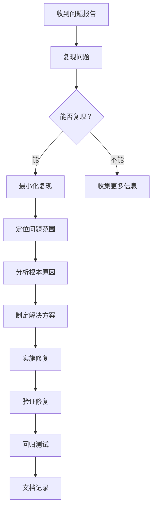

# TypeDOM Signals - 故障处理指南

> 🔧 **系统化的问题排查和解决方案**  
> 🚑 从诊断到修复的完整流程

---

## 📖 概述

本文档提供 `@type-dom/signals` 项目的故障处理指南，包括常见问题诊断、性能问题排查、内存泄漏检测等。

### 故障分类

1. **功能故障** - API 不工作、行为异常
2. **性能故障** - 执行缓慢、卡顿
3. **内存故障** - 内存泄漏、GC 频繁
4. **集成故障** - 与其他库冲突、兼容性问题

---

## 🔍 问题诊断流程

### 标准诊断步骤



### 信息收集清单

```markdown
## 问题报告模板

### 基本信息
- **TypeDOM Signals 版本**: v0.8.1
- **运行环境**: Node.js 18 / Chrome 120
- **操作系统**: Windows 11 / macOS 14

### 问题描述
- **现象**: 
- **预期行为**: 
- **实际行为**: 

### 复现步骤
1. 
2. 
3. 

### 代码示例
```typescript
// 最小化复现代码
```

### 错误信息
```
完整的错误堆栈
```

### 已尝试的解决方案
- [ ] 
- [ ] 
```

---

## 🐛 常见功能故障

### 故障 1: Effect 不执行

**症状**:
```typescript
const count = signal(0);

effect(() => {
  console.log('Count:', count.get()); // 只执行一次
});

count.set(1); // 没有再次打印
```

**可能原因**:
1. ✅ Effect 被停止
2. ❌ 依赖未追踪
3. ❌ 在批量更新中访问

**排查步骤**:

```typescript
// 检查 1: Effect 是否被停止
const stop = effect(() => {
  console.log('Running...');
  count.get();
});

// 检查 stop 是否被调用
console.log('Effect stopped?', /* check */);

// 检查 2: 依赖是否正确追踪
effect(() => {
  // ❌ 错误：直接访问 currentValue
  console.log(count.currentValue);
  
  // ✅ 正确：使用 get()
  console.log(count.get());
});

// 检查 3: 批量更新
startBatch();
count.set(1);
// Effect 不会立即执行
endBatch(); // 此时才会执行
```

**解决方案**:

```typescript
// 方案 1: 确保使用 get()
effect(() => {
  count.get(); // 建立依赖
});

// 方案 2: 检查是否在作用域内
const scope = effectScope(() => {
  effect(() => {
    count.get();
  });
});

// 不要提前调用 scope()

// 方案 3: 检查是否有条件依赖
effect(() => {
  if (condition.get()) {
    a.get(); // 当 condition 为 false 时，a 不会被追踪
  }
});
```

---

### 故障 2: Computed 不更新

**症状**:
```typescript
const count = signal(0);
const doubled = computed(() => count.get() * 2);

console.log(doubled.get()); // 0
count.set(5);
console.log(doubled.get()); // 仍然是 0（应该是 10）
```

**可能原因**:
1. ✅ Dirty 标志未设置
2. ❌ Getter 有副作用
3. ❌ 循环依赖

**排查步骤**:

```typescript
// 检查 1: 查看 flags
console.log('Flags:', doubled.flags);
// 应该包含 Dirty 标志

// 检查 2: 检查 getter 是否纯净
const bad = computed(() => {
  sideEffect(); // ❌ 副作用
  return count.get() * 2;
});

// 检查 3: 检查循环依赖
const a = computed(() => b.get() + 1);
const b = computed(() => a.get() + 1); // ❌ 循环
```

**解决方案**:

```typescript
// 方案 1: 手动标记 Dirty（不推荐）
doubled.flags |= ReactiveFlags.Dirty;

// 方案 2: 移除副作用
const good = computed(() => {
  return count.get() * 2; // 纯函数
});

// 方案 3: 重构避免循环
const base = signal(0);
const derived = computed(() => base.get() + 1);
```

---

### 故障 3: 依赖丢失

**症状**:
```typescript
const a = signal(1);
const b = signal(2);

const sum = computed(() => {
  return condition.get() ? a.get() : b.get();
});

// 切换 condition 后，sum 不更新
```

**原因**: 动态依赖切换导致部分依赖未被追踪

**解决方案**:

```typescript
// 方案 1: 显式追踪所有依赖
const sum = computed(() => {
  const cond = condition.get();
  const valA = a.get();
  const valB = b.get();
  return cond ? valA : valB;
});

// 方案 2: 使用 peek() 避免追踪
const sum = computed(() => {
  if (condition.get()) {
    return a.peek(); // 不建立依赖
  } else {
    return b.peek();
  }
});
```

---

## ⚡ 性能故障排查

### 性能问题 1: 更新缓慢

**症状**:
```typescript
// 大量 signals 同时更新
for (let i = 0; i < 1000; i++) {
  signals[i].set(newValue); // 每次更新都很慢
}
```

**诊断工具**:

```typescript
// 性能分析脚本
import { perfMonitor } from '../lib/performance-monitor';

// 开启监控
perfMonitor.reset();

// 执行操作
for (let i = 0; i < 1000; i++) {
  signals[i].set(i);
}

// 查看报告
perfMonitor.report();
```

**可能原因**:
1. ✅ 未使用批量更新
2. ❌ 依赖链过长
3. ❌ 重复计算

**优化方案**:

```typescript
// 方案 1: 使用批量更新
startBatch();
for (let i = 0; i < 1000; i++) {
  signals[i].set(i);
}
endBatch();

// 方案 2: 优化依赖结构
// ❌ 长链
const a = signal(0);
const b = computed(() => a.get() + 1);
const c = computed(() => b.get() + 1);
const d = computed(() => c.get() + 1);
// ... 10 层

// ✅ 扁平化
const base = signal(0);
const result = computed(() => {
  return base.get() + 10; // 直接计算
});

// 方案 3: 缓存计算结果
const expensive = computed(() => {
  const data = largeDataset.get();
  return memoize(() => heavyComputation(data))();
});
```

---

### 性能问题 2: 内存占用过高

**症状**:
- 应用运行一段时间后内存持续增长
- GC 频繁执行
- 页面响应变慢

**诊断工具**:

```bash
# Chrome DevTools Memory 面板
# 1. 打开 DevTools (F12)
# 2. Memory 选项卡
# 3. Take heap snapshot
# 4. 对比多个快照
```

```typescript
// 内存泄漏检测脚本
function detectLeaks() {
  const before = performance.memory?.usedJSHeapSize;
  
  // 执行操作
  for (let i = 0; i < 1000; i++) {
    createAndDestroySignal();
  }
  
  // 强制 GC（如果支持）
  if (global.gc) {
    global.gc();
  }
  
  const after = performance.memory?.usedJSHeapSize;
  
  console.log('Memory change:', after - before);
  
  if (after > before * 1.1) {
    console.warn('Possible memory leak detected!');
  }
}
```

**常见泄漏原因**:

```typescript
// 原因 1: Effect 未清理
function setup() {
  effect(() => {
    const id = setInterval(() => {
      console.log(count.get());
    }, 1000);
    // ❌ 缺少清理
  });
}

// ✅ 修复
function setup() {
  effect(() => {
    const id = setInterval(() => {
      console.log(count.get());
    }, 1000);
    
    return () => {
      clearInterval(id);
    };
  });
}

// 原因 2: 闭包引用
function createWatcher() {
  const largeData = new Array(1000000).fill('data');
  
  effect(() => {
    console.log(count.get());
    // ❌ largeData 被闭包引用，无法回收
  });
}

// ✅ 修复
function createWatcher() {
  effect(() => {
    console.log(count.get());
  });
  // largeData 在使用后立即释放
}

// 原因 3: DOM 引用未清理
function connectToDOM() {
  const element = document.getElementById('app');
  
  effect(() => {
    element.textContent = count.get();
    // ❌ element 引用一直存在
  });
  
  // ✅ 修复
  return () => {
    // 清理函数
  };
}
```

---

## 🔧 故障排查工具

### 调试模式

```typescript
// lib/debug-mode.ts
let debugMode = false;

export function enableDebug(): void {
  debugMode = true;
}

export function disableDebug(): void {
  debugMode = false;
}

export function debugLog(message: string, ...args: any[]): void {
  if (debugMode) {
    console.log(`[DEBUG] ${message}`, ...args);
  }
}

// 在 Signal 中使用
export class Signal<T> {
  get(): T {
    debugLog('Signal.get()', {
      value: this.pendingValue,
      flags: this.flags,
      activeSub,
    });
    
    // ... implementation
  }
}
```

### 依赖可视化

```typescript
// lib/dependency-graph.ts
interface DependencyNode {
  id: string;
  type: 'signal' | 'computed' | 'effect';
  deps: string[];
  subs: string[];
}

class DependencyGraph {
  private nodes: Map<string, DependencyNode> = new Map();
  
  track(node: DependencyNode): void {
    this.nodes.set(node.id, node);
  }
  
  visualize(): string {
    let output = 'digraph Dependencies {\n';
    
    this.nodes.forEach((node, id) => {
      output += `  ${id} [label="${node.type}: ${id}"];\n`;
      
      node.deps.forEach(depId => {
        output += `  ${id} -> ${depId};\n`;
      });
      
      node.subs.forEach(subId => {
        output += `  ${id} -> ${subId} [style=dashed];\n`;
      });
    });
    
    output += '}';
    return output;
  }
  
  findCircular(): string[][] {
    const visited = new Set<string>();
    const recursionStack = new Set<string>();
    const cycles: string[][] = [];
    
    function dfs(nodeId: string, path: string[]): void {
      if (recursionStack.has(nodeId)) {
        const cycleStart = path.indexOf(nodeId);
        cycles.push(path.slice(cycleStart));
        return;
      }
      
      if (visited.has(nodeId)) return;
      
      visited.add(nodeId);
      recursionStack.add(nodeId);
      path.push(nodeId);
      
      const node = this.nodes.get(nodeId);
      if (node) {
        node.deps.forEach(depId => dfs(depId, [...path]));
      }
      
      recursionStack.delete(nodeId);
    }
    
    this.nodes.forEach((_, id) => dfs(id, []));
    
    return cycles;
  }
}
```

### 使用示例

```typescript
// 启用调试
import { enableDebug } from './lib/debug-mode';
enableDebug();

// 可视化依赖图
import { DependencyGraph } from './lib/dependency-graph';

const graph = new DependencyGraph();

// 追踪节点
graph.track({
  id: 'count',
  type: 'signal',
  deps: [],
  subs: ['doubled'],
});

graph.track({
  id: 'doubled',
  type: 'computed',
  deps: ['count'],
  subs: ['effect_1'],
});

// 输出 DOT 格式（可用于 Graphviz）
console.log(graph.visualize());

// 检测循环依赖
const cycles = graph.findCircular();
if (cycles.length > 0) {
  console.error('Circular dependencies found:', cycles);
}
```

---

## 📋 故障排查清单

### 快速检查清单

**Effect 问题**:
- [ ] Effect 函数使用了 `get()` 而不是直接访问属性
- [ ] Effect 没有被 `stop()` 调用
- [ ] Effect 在作用域内且作用域未被清理
- [ ] 依赖的 signals 确实发生了变化

**Computed 问题**:
- [ ] Computed 被访问（调用 `get()`）
- [ ] 依赖的 signals 已更新
- [ ] Getter 是纯函数，无副作用
- [ ] 无循环依赖

**性能问题**:
- [ ] 使用了批量更新（`startBatch/endBatch`）
- [ ] 依赖链长度合理（< 10 层）
- [ ] 无重复计算
- [ ] 及时清理了不再使用的 effects

**内存问题**:
- [ ] Effects 都有清理函数
- [ ] 无长时间运行的定时器
- [ ] DOM 引用及时释放
- [ ] 无大型对象的长期引用

---

## 🆘 获取帮助

### 官方资源

- **GitHub Issues**: https://github.com/type-dom/signals/issues
- **Discussions**: https://github.com/type-dom/signals/discussions
- **文档**: ./AI-DOCS/

### 社区资源

- **Stack Overflow**: 使用标签 `type-dom-signals`
- **Discord**: （待添加）

### 提交 Issue 模板

```markdown
## Bug Report

### Description
简要描述问题

### Reproduction
https://stackblitz.com/edit/...

### Steps to reproduce
1. 
2. 
3. 

### Expected behavior


### Actual behavior

### Environment
- TypeDOM Signals: v0.8.1
- Browser: Chrome 120
- OS: Windows 11

### Additional context

```

---

## 🔗 相关文档

- [00-索引.md](./00-索引.md) - 文档导航
- [06-运维文档/部署指南.md](./06-运维文档/部署指南.md) - 部署流程
- [06-运维文档/监控告警.md](./06-运维文档/监控告警.md) - 监控配置
- [03-API 文档/错误码.md](./03-API 文档/错误码.md) - 错误定义

---

**维护者**: TypeDOM Core Team  
**最后更新**: 2026-03-18  
**许可**: MIT License
