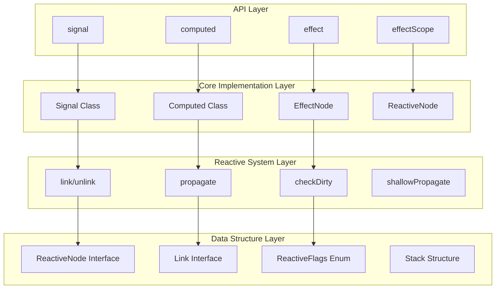
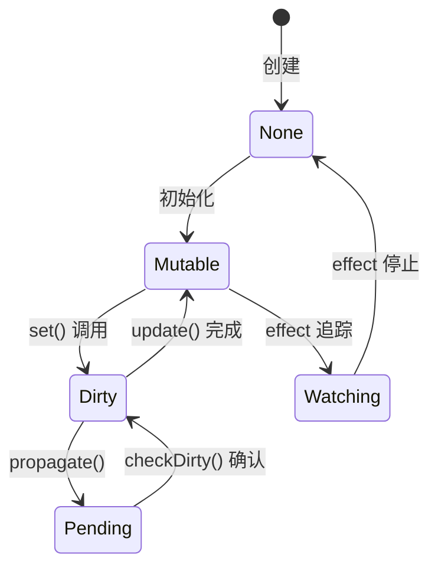
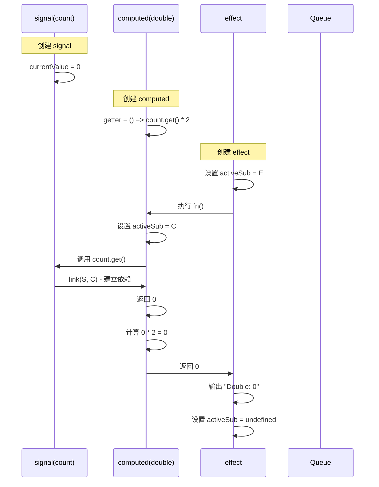
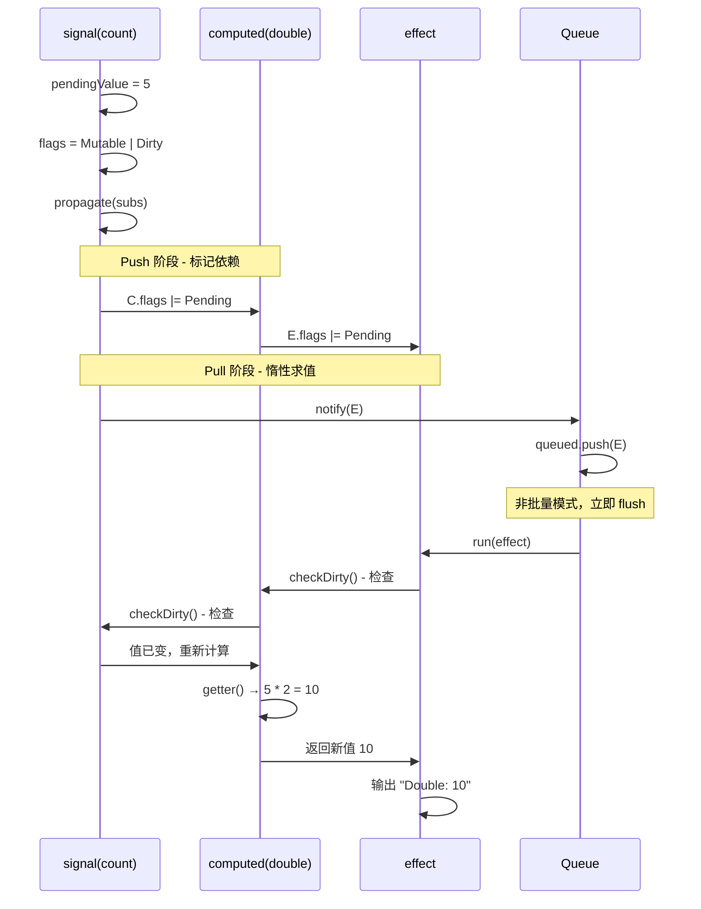

# TypeDOM Signals - 架构详解

> 🏗️ **Push-Pull 响应式系统架构完全指南**  
> 📐 深入理解依赖追踪和更新传播机制

---

## 📖 概述

本文档详细解析 `@type-dom/signals` 的架构设计，包括核心数据结构、算法流程和系统边界。

### 架构特色

- ✅ **Push-Pull 混合模型** - 结合推送和拉取的优势
- ✅ **非递归更新逻辑** - 避免栈溢出风险
- ✅ **惰性求值机制** - 只在需要时计算
- ✅ **自动依赖追踪** - 无需手动管理依赖关系

---

## 🎯 核心架构图

### 四层架构模型



---

## 📊 核心数据结构

### 1. ReactiveNode 接口

**作用**: 所有响应式节点的基类接口

```typescript
export interface ReactiveNode {
  deps?: Link;        // 依赖链表的头节点（我依赖谁）
  depsTail?: Link;    // 依赖链表的尾节点
  subs?: Link;        // 订阅链表的头节点（谁依赖我）
  subsTail?: Link;    // 订阅链表的尾节点
  flags: ReactiveFlags; // 状态标志位
}
```

**字段说明**:

| 字段 | 类型 | 作用 | 示例 |
|------|------|------|------|
| `deps` | `Link` | 指向第一个依赖 | computed 的 deps 指向它使用的 signal |
| `depsTail` | `Link` | 指向最后一个依赖 | 快速访问链表尾部 |
| `subs` | `Link` | 指向第一个订阅者 | signal 的 subs 指向使用它的 computed |
| `subsTail` | `Link` | 指向最后一个订阅者 | 快速添加新订阅者 |
| `flags` | `ReactiveFlags` | 节点状态标志 | Dirty, Pending, Watching 等 |

**可视化**:

```
Signal (count)
  ↓ subs
Link → Link → Link (三个 computed 订阅)
  ↑      ↑       ↑
sub    sub     sub

Computed (double)
  ↓ deps
Link (指向 count signal)
  ↑
dep
```

### 2. Link 接口

**作用**: 连接两个 ReactiveNode 的双向链表节点

```typescript
export interface Link {
  version: number;              // 版本号，用于验证有效性
  dep: ReactiveNode;            // 被依赖的节点
  sub: ReactiveNode;            // 订阅者节点
  prevSub: Link | undefined;    // 前一个订阅者
  nextSub: Link | undefined;    // 后一个订阅者
  prevDep: Link | undefined;    // 前一个依赖
  nextDep: Link | undefined;    // 后一个依赖
}
```

**双向链表结构**:

```
Signal (count)
  ↓ subs (订阅链表)
Link1 ←→ Link2 ←→ Link3
  ↓sub    ↓sub     ↓sub
Comp1   Comp2    Comp3

每个 Link 都有:
- prevSub/nextSub: 连接其他订阅者
- dep: 指向 Signal
- sub: 指向 Computed
```

**依赖链表**:

```
Computed (double)
  ↓ deps (依赖链表)
Link1 ←→ Link2
  ↓dep    ↓dep
Sig1    Sig2

每个 Link 都有:
- prevDep/nextDep: 连接其他依赖
- dep: 指向依赖的 Signal
- sub: 指向 Computed
```

### 3. ReactiveFlags 枚举

**作用**: 位运算标志，表示节点状态

```typescript
export const enum ReactiveFlags {
  None = 0,           // 000000 - 无状态
  Mutable = 1,        // 000001 - 可变/已变异
  Watching = 2,       // 000010 - 正在监听
  RecursedCheck = 4,  // 000100 - 递归检查中
  Recursed = 8,       // 001000 - 已递归
  Dirty = 16,         // 010000 - 脏数据需更新
  Pending = 32,       // 100000 - 待处理
}
```

**位运算组合**:

```typescript
// 组合标志
const flags = ReactiveFlags.Mutable | ReactiveFlags.Dirty; // 17

// 检查标志
if (node.flags & ReactiveFlags.Dirty) {
  // 需要更新
}

// 清除标志
node.flags &= ~ReactiveFlags.Pending;

// 设置标志
node.flags |= ReactiveFlags.Watching;
```

**状态转换图**:



---

## 🔧 核心算法详解

### 1. link 函数 - 建立依赖关系

**作用**: 在依赖 (dep) 和订阅者 (sub) 之间建立双向链接

**实现**:

```typescript
function link(dep: ReactiveNode, sub: ReactiveNode, version: number): void {
  // 1. 检查是否已存在，避免重复链接
  const prevDep = sub.depsTail;
  if (prevDep !== undefined && prevDep.dep === dep) {
    return; // 已经链接过
  }
  
  // 2. 查找是否已有该依赖
  const nextDep = prevDep !== undefined ? prevDep.nextDep : sub.deps;
  if (nextDep !== undefined && nextDep.dep === dep) {
    nextDep.version = version; // 更新版本号
    sub.depsTail = nextDep;    // 更新尾指针
    return;
  }
  
  // 3. 检查订阅端是否已存在
  const prevSub = dep.subsTail;
  if (prevSub !== undefined && prevSub.version === version && prevSub.sub === sub) {
    return; // 已经在订阅列表中
  }
  
  // 4. 创建新链接节点
  const newLink = {
    version,
    dep,
    sub,
    prevDep,
    nextDep,
    prevSub,
    nextSub: undefined,
  };
  
  // 5. 更新双向链表
  sub.depsTail = dep.subsTail = newLink;
  
  if (nextDep !== undefined) nextDep.prevDep = newLink;
  if (prevDep !== undefined) prevDep.nextDep = newLink;
  else sub.deps = newLink;
  
  if (prevSub !== undefined) prevSub.nextSub = newLink;
  else dep.subs = newLink;
}
```

**执行流程**:

```
场景：computed 读取 signal

1. computed.get() 被调用
2. activeSub 指向当前 computed
3. signal.get() 内部调用 link(signal, computed, cycle)
4. 创建 Link 节点:
   - dep: signal
   - sub: computed
   - version: 当前周期号
5. 将 Link 插入:
   - signal.subs 链表 (signal 知道谁订阅了它)
   - computed.deps 链表 (computed 知道它依赖谁)
```

### 2. propagate 函数 - 传播更新

**作用**: 当信号变化时，沿订阅链向下传播标记

**关键优化**: 使用栈结构替代递归，避免栈溢出

**实现**:

```typescript
function propagate(link: Link): void {
  let next = link.nextSub;
  let stack: Stack<Link | undefined> | undefined;

  top: do {
    const sub = link.sub;
    let flags = sub.flags;

    // 1. 根据状态设置标志
    if (!(flags & (ReactiveFlags.RecursedCheck | ReactiveFlags.Recursed | ReactiveFlags.Dirty | ReactiveFlags.Pending))) {
      sub.flags = flags | ReactiveFlags.Pending; // 标记为待处理
    } else if (!(flags & (ReactiveFlags.RecursedCheck | ReactiveFlags.Recursed))) {
      flags = ReactiveFlags.None;
    } else if (!(flags & ReactiveFlags.RecursedCheck)) {
      sub.flags = (flags & ~ReactiveFlags.Recursed) | ReactiveFlags.Pending;
    } else if (!(flags & (ReactiveFlags.Dirty | ReactiveFlags.Pending)) && isValidLink(link, sub)) {
      sub.flags = flags | (ReactiveFlags.Recursed | ReactiveFlags.Pending);
      flags &= ReactiveFlags.Mutable;
    } else {
      flags = ReactiveFlags.None;
    }

    // 2. 如果是观察者，通知它
    if (flags & ReactiveFlags.Watching) {
      notify(sub);
    }

    // 3. 如果是可变节点（computed/signal），继续向下传播
    if (flags & ReactiveFlags.Mutable) {
      const subSubs = sub.subs;
      if (subSubs !== undefined) {
        const nextSub = (link = subSubs).nextSub;
        if (nextSub !== undefined) {
          stack = { value: next, prev: stack }; // 压栈保存
          next = nextSub;
          continue;
        }
      }
    }

    // 4. 移动到下一个订阅者
    if ((link = next!) !== undefined) {
      next = link.nextSub;
      continue;
    }

    // 5. 从栈中恢复
    while (stack !== undefined) {
      link = stack.value!;
      stack = stack.prev; // 出栈
      if (link !== undefined) {
        next = link.nextSub;
        continue top;
      }
    }

    break;
  } while (true);
}
```

**执行流程示例**:

```
场景：signal.set() 触发更新链

signal.set( newValue )
  ↓
propagate(signal.subs)
  ↓
遍历所有订阅者:
  - computed1: flags |= Pending
  - computed2: flags |= Pending
  - effect: notify(effect) → 加入队列
  ↓
如果有嵌套订阅:
  - 压栈保存当前状态
  - 继续向下传播
  - 完成后出栈恢复
```

### 3. checkDirty 函数 - 检查是否需要更新

**作用**: 惰性检查依赖链，确定节点是否真的变脏

**关键优化**: 同样使用栈结构替代递归

**实现** (简化版):

```typescript
function checkDirty(link: Link, sub: ReactiveNode): boolean {
  let stack: Stack<Link> | undefined;
  let checkDepth = 0;
  let dirty = false;

  top: do {
    const dep = link.dep;
    const flags = dep.flags;

    // 1. 如果自身已脏，直接返回
    if (sub.flags & ReactiveFlags.Dirty) {
      dirty = true;
    } 
    // 2. 如果依赖是脏的，更新它并检查
    else if ((flags & (ReactiveFlags.Mutable | ReactiveFlags.Dirty)) === (ReactiveFlags.Mutable | ReactiveFlags.Dirty)) {
      if (update(dep)) {
        dirty = true;
      }
    }
    // 3. 如果依赖有待处理的更新，递归检查
    else if ((flags & (ReactiveFlags.Mutable | ReactiveFlags.Pending)) === (ReactiveFlags.Mutable | ReactiveFlags.Pending)) {
      stack = { value: link, prev: stack }; // 压栈
      link = dep.deps!;
      sub = dep;
      ++checkDepth;
      continue;
    }

    // 4. 移动到下一个依赖
    if (!dirty) {
      const nextDep = link.nextDep;
      if (nextDep !== undefined) {
        link = nextDep;
        continue;
      }
    }

    // 5. 回溯
    while (checkDepth--) {
      // ... 回溯逻辑
    }

    return dirty;
  } while (true);
}
```

**惰性检查策略**:

```
computed.get() 被调用时:
  ↓
检查 flags:
  - 如果是 Dirty → 立即更新
  - 如果是 Pending → 调用 checkDirty()
  - 否则 → 返回缓存值
  ↓
checkDirty() 递归检查依赖链:
  - 只检查真正需要的依赖
  - 跳过未变化的分支
  - 发现一个脏的就返回 true
```

### 4. flush 函数 - 执行更新队列

**作用**: 批量执行所有待处理的 effect

```typescript
function flush(): void {
  try {
    // 1. 按顺序执行队列中的 effect
    while (notifyIndex < queuedLength) {
      const effect = queued[notifyIndex]!;
      queued[notifyIndex++] = undefined;
      run(effect);
    }
  } finally {
    // 2. 清理剩余项
    while (notifyIndex < queuedLength) {
      const effect = queued[notifyIndex]!;
      queued[notifyIndex++] = undefined;
      effect.flags |= ReactiveFlags.Watching | ReactiveFlags.Recursed;
    }
    notifyIndex = 0;
    queuedLength = 0;
  }
}
```

**执行时机**:

```typescript
// 1. 非批量模式下，set() 后立即 flush
signal.set(value) {
  if (this.pendingValue !== value) {
    propagate(subs);
    if (!batchDepth) {
      flush(); // 立即执行
    }
  }
}

// 2. 批量模式下，endBatch() 时统一 flush
endBatch() {
  if (!--batchDepth) {
    flush(); // 批量结束后执行
  }
}
```

---

## 🔄 完整数据流

### 场景 1: 创建响应式链

```typescript
const count = signal(0);
const double = computed(() => count.get() * 2);
effect(() => {
  console.log('Double:', double.get());
});
```

**执行流程**:



### 场景 2: 触发更新链

```typescript
count.set(5);
```

**执行流程**:



---

## ⚙️ 性能优化机制

### 1. 避免重复计算

```typescript
const count = signal(0);
const double = computed(() => count.get() * 2);
const quadruple = computed(() => double.get() + double.get());

quadruple.get(); // 10
count.set(5);
quadruple.get(); // 30 (不是 50，因为 double 只计算一次)
```

**优化原理**:

```
quadruple 依赖 double (两次读取同一个 computed)

第一次 get():
  quadruple → double → count
  double 计算一次，缓存结果
  quadruple 读取两次缓存

count.set(5) 后:
  quadruple.flags = Pending
  double.flags = Pending
  
第二次 get():
  checkDirty(quadruple):
    → checkDirty(double):
      → checkDirty(count): 无变化
      → double 不脏
    → quadruple 不脏
  返回缓存值
```

### 2. 批量更新优化

```typescript
startBatch();
count.set(1);
count.set(2);
count.set(3);
endBatch();

// 只触发 1 次 effect 执行，而不是 3 次
```

**内部机制**:

```
batchDepth = 0

startBatch() → batchDepth = 1
count.set(1) → propagate(), 但 !batchDepth 为 false，不 flush
count.set(2) → propagate(), 但 !batchDepth 为 false，不 flush
count.set(3) → propagate(), 但 !batchDepth 为 false，不 flush

endBatch() → batchDepth = 0
  → !batchDepth 为 true
  → flush() - 统一执行所有累积的通知
```

### 3. 依赖清理优化

```typescript
const stop = effect(() => {
  if (condition) {
    count.get(); // 条件依赖
  }
});

condition = false;
count.set(1); // 不会触发 effect，因为已清理依赖
```

**清理机制**:

```
每次 effect 重新执行:
  1. purgeDeps(effect) - 清理旧依赖
  2. 重新执行 fn()
  3. 建立新依赖链
  
如果 condition 变为 false:
  - effect 不再读取 count
  - count.subs 中移除 effect 的链接
  - count.set() 不再通知 effect
```

---

## 🎯 系统边界和限制

### 支持的场景

✅ **适用场景**:
- 细粒度的响应式状态管理
- 复杂的计算属性依赖链
- 高频更新的实时数据展示
- 需要精确控制更新时机的场景

### 不支持的场景

❌ **不适用场景**:
- 深度监听对象内部变化（需用 deep signals）
- 异步依赖追踪（需手动处理）
- 跨线程响应式（Web Worker 场景）

### 已知限制

⚠️ **限制说明**:

1. **对象/数组引用问题**:
   ```typescript
   const state = signal({ count: 0 });
   state.get().count++; // ❌ 不会触发更新
   
   // ✅ 正确做法
   state.update(s => ({ ...s, count: s.count + 1 }));
   // 或
   trigger(state); // 手动触发
   ```

2. **循环依赖检测**:
   ```typescript
   const a = computed(() => b.get());
   const b = computed(() => a.get()); // ❌ 无限循环
   
   // 系统不会自动检测，需要开发者避免
   ```

3. **异步更新**:
   ```typescript
   effect(async () => {
     const data = await fetch(); // ⚠️ 不会追踪异步依赖
   });
   
   // ✅ 正确做法
   const data = signal(null);
   effect(() => {
     fetch().then(d => data.set(d));
   });
   ```

---

## 📈 扩展点

### 自定义响应式系统

```typescript
import { createReactiveSystem } from './system';

const { link, unlink, propagate, checkDirty } = createReactiveSystem({
  update(node) {
    // 自定义更新逻辑
    return true;
  },
  notify(node) {
    // 自定义通知逻辑
  },
  unwatched(node) {
    // 当没有订阅者时的清理逻辑
  }
});
```

### Deep Signals 扩展

```typescript
// libs/signals/deep/index.ts
export function deepSignal<T extends object>(value: T): DeepSignal<T> {
  // 深度代理对象，监听内部变化
}

export function watch<T>(
  source: WatchSource<T>,
  callback: WatchCallback<T>,
  options?: WatchOptions
): () => void {
  // 高级监听功能
}
```

---

## 📚 相关文档

- [`AI-README.md`](./AI-README.md) - 总索引
- [`SIGNALS-API-GUIDE.md`](./SIGNALS-API-GUIDE.md) - API 参考
- [`CODING-STANDARDS.md`](./CODING-STANDARDS.md) - 编码规范
- [`PERFORMANCE-GUIDE.md`](./PERFORMANCE-GUIDE.md) - 性能优化

---

**最后更新**: 2026-03-13  
**维护者**: TypeDOM Core Team  
**许可**: MIT License
