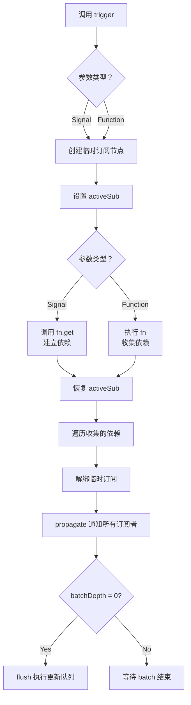

# TypeDOM Signals - Trigger函数完全指南

> ⚡ **手动触发响应式更新的强大工具**  
> 📍 用于处理引用类型内部变化或特殊场景的更新触发

---

## 📖 概述

`trigger` 是 TypeDOM Signals 提供的一个**高级 API**，用于在特殊场景下手动触发响应式系统的更新。

### 核心用途

- ✅ **引用类型内部变化** - 当数组/对象内部值改变但引用不变时
- ✅ **强制重新计算** - 手动触发 computed 或 effect 的重新执行
- ✅ **外部事件集成** - 将非响应式事件连接到响应式系统
- ✅ **测试和调试** - 手动控制更新时机

---

## 🔧 API 定义

```typescript
export function trigger(fn: Signal | (() => void)): void
```

### 参数

| 参数 | 类型 | 说明 |
|------|------|------|
| `fn` | `Signal \| (() => void)` | 要触发的信号或函数 |

### 返回值

`void` - 不返回任何值

---

## 💡 工作原理

### 执行流程



### 关键步骤解析

#### 1. 创建临时订阅节点
```typescript
const sub: ReactiveNode = {
  deps: undefined,
  depsTail: undefined,
  flags: ReactiveFlags.Watching,
};
```
创建一个一次性的订阅者，用于收集依赖

#### 2. 收集依赖
```typescript
const prevSub = setActiveSub(sub);
try {
  if (fn instanceof Signal) {
    fn.get();        // Signal: 读取值，建立依赖
  } else {
    fn();            // Function: 执行函数，收集依赖
  }
} finally {
  activeSub = prevSub;  // 恢复之前的订阅者
}
```

#### 3. 传播更新
```typescript
let link = sub.deps;
while (link !== undefined) {
  const dep = link.dep;
  link = unlink(link, sub);  // 解绑临时订阅
  const subs = dep.subs;
  if (subs !== undefined) {
    sub.flags = ReactiveFlags.None;
    propagate(subs);           // 通知所有订阅者
    shallowPropagate(subs);
  }
}
```

#### 4. 执行刷新
```typescript
if (!batchDepth) {
  flush();  // 立即执行更新队列
}
```

---

## 📚 使用场景

### 场景 1: 数组内部变化

**问题**: 直接修改数组不会触发更新

```typescript
const arr = signal<number[]>([]);
const length = computed(() => arr.get().length);

console.log(length.get());  // 0

// ❌ 这不会触发更新
arr.get().push(1);
console.log(length.get());  // 仍然是 0

// ✅ 使用 trigger 手动触发
trigger(arr);
console.log(length.get());  // 1
```

### 场景 2: 对象属性变化

```typescript
const user = signal({ name: 'John', age: 30 });
const displayName = computed(() => user.get().name);

console.log(displayName.get());  // "John"

// ❌ 直接修改属性不会触发更新
user.get().name = 'Jane';
console.log(displayName.get());  // 仍然是 "John"

// ✅ 使用 trigger 强制更新
trigger(user);
console.log(displayName.get());  // "Jane"
```

### 场景 3: Map/Set 等集合类型

```typescript
const map = signal(new Map<string, number>());
const size = computed(() => map.get().size);

console.log(size.get());  // 0

// ❌ Map 内部变化不会触发
map.get().set('key', 1);
console.log(size.get());  // 仍然是 0

// ✅ 使用 trigger
trigger(map);
console.log(size.get());  // 1
```

### 场景 4: 批量手动触发

```typescript
const a = signal([1, 2, 3]);
const b = signal([4, 5, 6]);
const total = computed(() => a.get().length + b.get().length);

console.log(total.get());  // 6

// 同时触发多个信号
trigger(() => {
  a.get().push(7);
  b.get().push(8);
});

console.log(total.get());  // 8
```

---

## 🎯 最佳实践

### ✅ 推荐用法

#### 1. 仅在必要时使用
```typescript
// 优先使用 set() 创建新引用
const arr = signal([1, 2, 3]);
arr.set([...arr.get(), 4]);  // ✅ 推荐

// 只在无法创建新引用时使用 trigger
const originalArr = [1, 2, 3];
externalLib.mutateArray(originalArr);  // 第三方库修改
trigger(arr);  // ✅ 必要时的解决方案
```

#### 2. 明确触发范围
```typescript
// ✅ 精确触发特定信号
trigger(signalA);

// ⚠️ 避免不必要的多信号触发
trigger(() => {
  signalA.get();
  signalB.get();
  signalC.get();
});
```

#### 3. 配合 batch 使用
```typescript
// 多个 trigger 时使用 batch 优化性能
startBatch();
trigger(signalA);
trigger(signalB);
endBatch();
```

### ❌ 避免滥用

```typescript
// ❌ 不应该频繁使用 trigger
effect(() => {
  data.get();
  trigger(data);  // 会导致无限循环！
});

// ❌ 不应该替代正常的响应式更新
const count = signal(0);
count.set(count.get() + 1);  // ✅ 正确
trigger(count);               // ❌ 错误使用
```

---

## 🧪 完整测试用例

### 基础功能测试

```typescript
import { describe, expect, it } from 'vitest';
import { computed, effect, signal, trigger } from '../src';

describe('trigger 基础功能', () => {
  it('should not throw when triggering with no dependencies', () => {
    expect(() => trigger(() => {})).not.toThrow();
  });

  it('should trigger single signal', () => {
    const count = signal(0);
    let executions = 0;

    effect(() => {
      executions++;
      count.get();
    });

    expect(executions).toBe(1);
    trigger(count);
    expect(executions).toBe(2);
  });

  it('should trigger with signal getter', () => {
    const value = signal(0);
    const doubled = computed(() => value.get() * 2);

    expect(doubled.get()).toBe(0);
    trigger(value);
    expect(doubled.get()).toBe(0);  // 值没变，但会重新计算
  });
});
```

### 引用类型测试

```typescript
describe('trigger 引用类型', () => {
  it('should trigger array mutation', () => {
    const arr = signal<number[]>([]);
    const length = computed(() => arr.get().length);

    expect(length.get()).toBe(0);
    arr.get().push(1);
    trigger(arr);
    expect(length.get()).toBe(1);
  });

  it('should trigger object property change', () => {
    const user = signal({ name: 'John', age: 30 });
    const name = computed(() => user.get().name);

    expect(name.get()).toBe('John');
    user.get().name = 'Jane';
    trigger(user);
    expect(name.get()).toBe('Jane');
  });

  it('should trigger Map mutation', () => {
    const map = signal(new Map<string, number>());
    const size = computed(() => map.get().size);

    expect(size.get()).toBe(0);
    map.get().set('key', 1);
    trigger(map);
    expect(size.get()).toBe(1);
  });

  it('should trigger Set mutation', () => {
    const set = signal(new Set<number>());
    const hasOne = computed(() => set.get().has(1));

    expect(hasOne.get()).toBe(false);
    set.get().add(1);
    trigger(set);
    expect(hasOne.get()).toBe(true);
  });
});
```

### 复杂场景测试

```typescript
describe('trigger 复杂场景', () => {
  it('should trigger multiple signals at once', () => {
    const a = signal([1, 2, 3]);
    const b = signal([4, 5, 6]);
    const total = computed(() => a.get().length + b.get().length);

    expect(total.get()).toBe(6);
    
    trigger(() => {
      a.get().push(7);
      b.get().push(8);
    });
    
    expect(total.get()).toBe(8);
  });

  it('should trigger nested computed', () => {
    const src = signal({ value: 0 });
    const step1 = computed(() => src.get().value);
    const step2 = computed(() => step1.get() * 2);
    const step3 = computed(() => step2.get() + 10);

    expect(step3.get()).toBe(10);
    
    src.get().value = 5;
    trigger(src);
    
    expect(step3.get()).toBe(20);  // (5 * 2) + 10
  });

  it('should trigger effect chain', () => {
    const data = signal({ items: [] as number[] });
    let effectCalls = 0;

    effect(() => {
      effectCalls++;
      data.get().items.length;
    });

    expect(effectCalls).toBe(1);
    
    data.get().items.push(1);
    trigger(data);
    
    expect(effectCalls).toBe(2);
  });

  it('should handle circular dependencies', () => {
    const a = signal<{ ref?: any }>({});
    const b = signal<{ ref?: any }>({});

    let calls = 0;
    effect(() => {
      calls++;
      a.get().ref?.();
      b.get().ref?.();
    });

    expect(calls).toBe(1);

    trigger(() => {
      a.get().ref = () => {};
      b.get().ref = () => {};
    });

    expect(calls).toBe(2);
  });
});
```

### 边界条件测试

```typescript
describe('trigger 边界条件', () => {
  it('should work inside batch', () => {
    const arr = signal<number[]>([]);
    const length = computed(() => arr.get().length);

    startBatch();
    arr.get().push(1);
    trigger(arr);
    expect(length.get()).toBe(1);  // 不会立即刷新
    endBatch();
  });

  it('should not trigger if no subscribers', () => {
    const signal = signal({ value: 0 });
    signal.get().value = 1;
    expect(() => trigger(signal)).not.toThrow();
  });

  it('should handle null/undefined values', () => {
    const nullable = signal<object | null>(null);
    const check = computed(() => nullable.get() !== null);

    expect(check.get()).toBe(false);
    
    nullable.set({});
    trigger(nullable);
    expect(check.get()).toBe(true);
  });

  it('should work with readonly signals', () => {
    const readonly = signal(Object.freeze({ value: 0 }));
    let calls = 0;

    effect(() => {
      calls++;
      readonly.get().value;
    });

    expect(calls).toBe(1);
    trigger(readonly);
    expect(calls).toBe(2);
  });
});
```

### 性能相关测试

```typescript
describe('trigger 性能', () => {
  it('should only trigger once per call', () => {
    const src = signal<number[]>([]);
    const a = computed(() => src.get().length);
    const b = computed(() => src.get().length);
    const c = computed(() => a.get() + b.get());

    let calls = 0;
    effect(() => {
      calls++;
      c.get();
    });

    expect(calls).toBe(1);
    
    src.get().push(1);
    trigger(src);
    
    expect(calls).toBe(2);  // 应该只触发一次
  });

  it('should handle deep dependency chains', () => {
    const base = signal({ value: 0 });
    const d1 = computed(() => base.get().value);
    const d2 = computed(() => d1.get() * 2);
    const d3 = computed(() => d2.get() + 1);
    const d4 = computed(() => d3.get() * 3);

    let calls = 0;
    effect(() => {
      calls++;
      d4.get();
    });

    expect(calls).toBe(1);
    
    base.get().value = 10;
    trigger(base);
    
    expect(calls).toBe(2);
    expect(d4.get()).toBe(63);  // ((10 * 2) + 1) * 3
  });
});
```

---

## ⚠️ 注意事项

### 1. 不是万能药
```typescript
// ❌ 不应该用 trigger 修复设计问题
const badDesign = signal({ count: 0 });
badDesign.get().count++;  // 错误的状态管理
trigger(badDesign);       // 补丁代码

// ✅ 正确的做法
const goodDesign = signal(0);
goodDesign.set(goodDesign.get() + 1);  // 清晰的更新
```

### 2. 可能影响性能
```typescript
// ❌ 避免在循环中使用
for (let i = 0; i < 1000; i++) {
  trigger(signal);  // 性能灾难
}

// ✅ 批量处理
startBatch();
for (let i = 0; i < 1000; i++) {
  // 准备数据
}
trigger(signal);  // 只触发一次
endBatch();
```

### 3. 小心无限循环
```typescript
// ❌ 危险：可能导致无限循环
effect(() => {
  data.get();
  trigger(data);  // 触发自己再次执行
});

// ✅ 安全：有条件地触发
effect(() => {
  const value = data.get();
  if (needsUpdate(value)) {
    trigger(otherSignal);  // 触发其他信号
  }
});
```

---

## 🔄 与其他 API 的对比

| API | 用途 | 自动追踪 | 手动触发 |
|-----|------|---------|---------|
| `set()` | 更新信号值 | ✅ | ❌ |
| `trigger()` | 手动触发更新 | ✅ | ✅ |

### 选择指南

```typescript
// 场景 1: 普通值更新
count.set(count.get() + 1);  // ✅ 使用 set

// 场景 2: 数组/对象内部变化
arr.get().push(1);
trigger(arr);  // ✅ 使用 trigger

// 场景 3: Computed 强制更新
trigger(computed);  // ✅ 内部使用，不推荐外部调用
```

---

## 📊 总结

### 核心优势
- ✅ **处理引用类型** - 解决数组/对象内部变化的检测
- ✅ **灵活控制** - 手动决定何时触发更新
- ✅ **兼容性好** - 与现有响应式系统无缝集成

### 使用原则
1. **优先使用 set()** - 保持响应式系统的纯净性
2. **必要时才用 trigger** - 作为补充手段，而非常规方法
3. **注意性能影响** - 避免频繁或大量使用

### 适用场景
- ✅ 第三方库修改了响应式数据
- ✅ 必须保持引用相同的特殊需求
- ✅ 测试和调试时的手动控制
- ✅ 与外部系统集成

---

**最后更新**: 2026-03-13  
**维护者**: TypeDOM Core Team  
**许可**: MIT License
